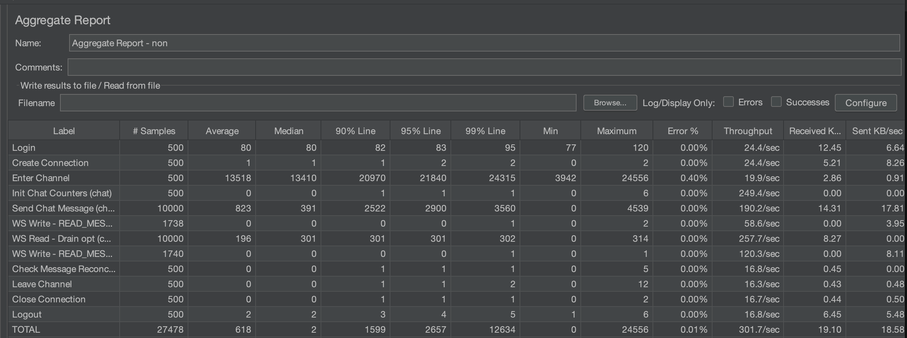
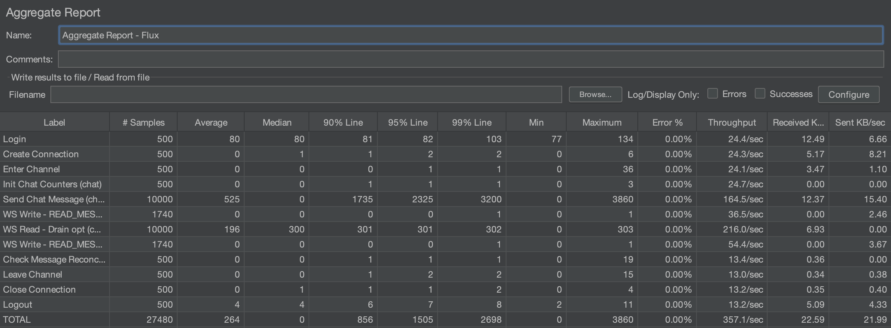
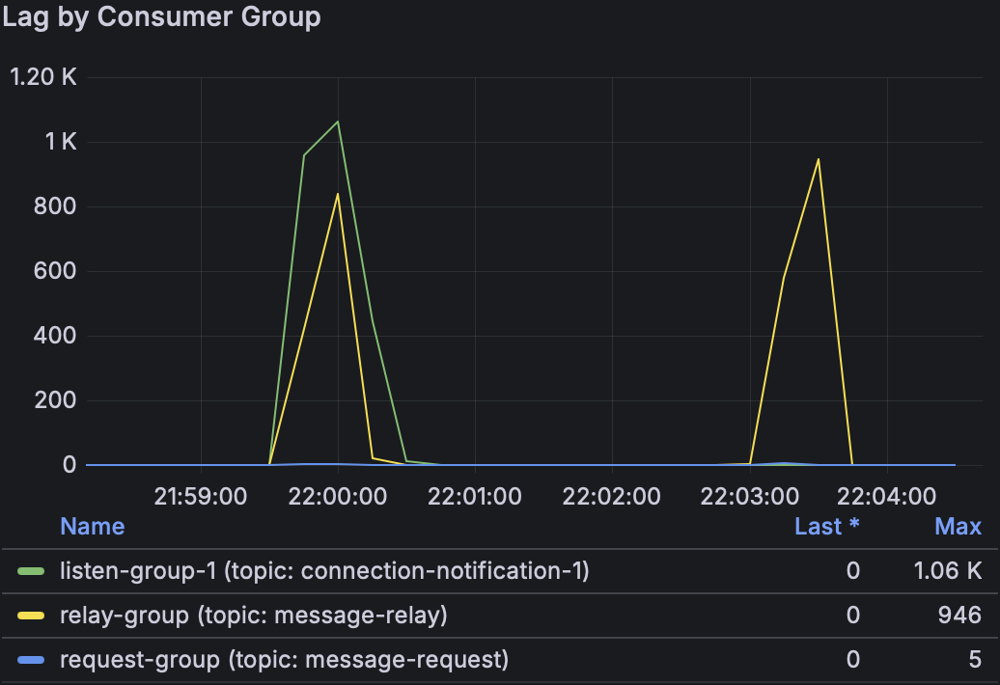

# 성능 측정 기록

JMeter 부하 테스트와 Grafana Kafka UI를 사용하여 WebSocket 서버 구현체별 성능을 비교한 결과입니다.

## 테스트 시나리오

| # | 시나리오 | 구현체 | 설명 |
|---|---------|-------|------|
| 1 | Tomcat | `message-connection` | Spring MVC 기반 WebSocket (Tomcat) |
| 2 | WebFlux | `message-connection-flux` | Spring WebFlux 기반 WebSocket (Netty), 단일 인스턴스 |
| 3 | WebFlux Scale Out | `message-connection-flux` x2 | WebFlux 인스턴스 2개 수평 확장 |

### 공통 테스트 조건

- 동시 접속 사용자: 500명
- 채팅 메시지 전송: 사용자당 20회 (총 10,000건)
- 시나리오 순서: Login → Create Connection → Enter Channel → Send Chat Message x20 → Close Connection → Logout

---

## 결과 비교 (Tomcat vs WebFlux)

| 지표 | Tomcat | WebFlux | 개선율 |
|-----|--------|---------|--------|
| 전체 Throughput | 301.7/sec | 357.1/sec | +18.4% |
| 전체 평균 응답시간 | 618ms | 264ms | -57.3% |
| Send Chat Message 평균 | 823ms | 525ms | -36.2% |
| Send Chat Message p90 | 2,620ms | 1,735ms | -33.8% |
| Send Chat Message p99 | 4,539ms | 3,200ms | -29.5% |
| Send Chat Message Max | 4,539ms | 3,860ms | -14.9% |
| Error율 | 0% | 0% | - |

---

## 시나리오 1 — Tomcat

- 전체 평균 응답: **618ms**, Throughput: **301.7/sec**
- Send Chat Message p99이 **4,539ms**로, 고부하 시 지연이 크게 증가
- Tomcat 스레드 기반 블로킹 I/O 특성상 동시 연결 수 증가 시 스레드 경합 발생

---

## 시나리오 2 — WebFlux (단일 인스턴스)

- 전체 평균 응답: **264ms**, Throughput: **357.1/sec**
- Send Chat Message p99: **3,200ms** (Tomcat 대비 29.5% 개선)
- Netty 기반 논블로킹 I/O로 적은 스레드로 높은 동시성 처리
- 동일한 부하에서 Tomcat보다 응답 지연 분포가 안정적

---

## 시나리오 3 — WebFlux Scale Out (2 인스턴스)

- JMeter 리포트 대신 **Kafka Consumer Group Lag** 차트로 측정
- 2회 테스트 모두 lag이 최대 약 1,060건(listen-group-1), 946건(relay-group)까지 쌓였다가 **즉시 0으로 수렴**
- `request-group` (message-request 토픽)은 최대 5건으로 매우 낮게 유지
- 인스턴스별 전용 토픽(`connection-notification-{server.id}`) 구조 덕분에 스케일아웃 후에도 메시지 라우팅 정확도 유지
- Kafka backlog가 테스트 종료 후 잔존하지 않아 처리 능력이 충분함을 확인

---

## 결론

1. **WebFlux가 Tomcat 대비 전반적으로 우수**: Throughput +18%, 평균 응답시간 -57%
2. **고부하 tail latency 개선이 핵심**: p99 기준 1,339ms 단축 (4,539ms → 3,200ms)
3. **Scale Out 구조 검증 완료**: 인스턴스별 Kafka 토픽 + Redis 위치 정보 매핑 설계가 다중 인스턴스 환경에서 정상 동작하며, 부하 종료 후 Kafka lag이 0으로 완전 수렴
